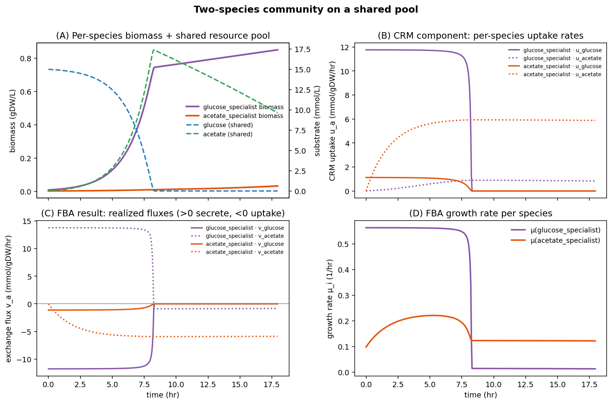

# CRM-dFBA

### **[→ Experiment report](https://vivarium-collective.github.io/CRM-FBA/)**

[](https://vivarium-collective.github.io/CRM-FBA/)

A process-bigraph process that runs dynamic Flux Balance Analysis (dFBA)
with exchange bounds derived from a configurable **Consumer Resource
Model** (CRM). This is the CRM analogue of the Michaelis-Menten-constrained
`DynamicFBA` in
[`spatio-flux`](https://github.com/vivarium-collective/spatio-flux):
the kinetics layer is swapped out for a pluggable CRM chosen from a
registry.

## Layout

```
crm_dfba/
  processes/crm_dfba.py     # CRMDynamicFBA(Process)
  crms/
    base.py                 # BaseCRM abstract class
    registry.py             # CRM_REGISTRY, get_crm, register_crm
    monod.py                # MonodCRM (Michaelis-Menten; parity with spatio-flux)
    macarthur.py            # MacArthurCRM (logistic / external / tilman)
    mcrm.py                 # MCRMCrm, MiCRMCrm
    adaptive.py             # AdaptiveCRM (Picciani-Mori)
  demo.py                   # minimal runnable example
ecoli/, yeast/              # prior prototype scripts (kept for reference)
```

## Coupling

**`uptake_bounds`** — the CRM computes a per-resource uptake rate
`u_a(R, X)`; the process sets the corresponding FBA exchange reaction
lower bound to `-u_a`. FBA then picks `μ` and realized exchange fluxes
consistent with the GSM stoichiometry. Extracellular updates use the
*realized* FBA fluxes, not the CRM prediction.

## Configuration

```python
from crm_dfba import CRMDynamicFBA

proc = CRMDynamicFBA(config={
    "model_file": "textbook",
    "substrate_update_reactions": {
        "glucose": "EX_glc__D_e",
        "acetate": "EX_ac_e",
    },
    "bounds": {"EX_o2_e": {"lower": -20, "upper": None}},
    "biomass_reaction": "Biomass_Ecoli_core",
    "crm": {
        "type": "macarthur",          # or monod | mcrm | micrm | adaptive
        "params": {
            "c": {"glucose": 0.9, "acetate": 0.2},
            "resource_mode": "external",
        },
    },
})
```

## CRM types

| type        | class          | required params                       |
| ----------- | -------------- | ------------------------------------- |
| `monod`     | `MonodCRM`     | `kinetic_params` = `{res: (Km, Vmax)}`|
| `macarthur` | `MacArthurCRM` | `c = {res: coeff}`, `resource_mode`   |
| `mcrm`      | `MCRMCrm`      | `C = {res: coeff}`                    |
| `micrm`     | `MiCRMCrm`     | `c = {res: coeff}`                    |
| `adaptive`  | `AdaptiveCRM`  | `v`, `K`, `lam`, `E_star` (+ `A0`)    |

Register a new CRM with `register_crm(MyCRM)` (subclass `BaseCRM`).

## Install

```bash
pip install -e .
python -m crm_dfba.demo
```

## Experiment suite

Run the full CRM-FBA experiment suite and generate the HTML report at
`docs/index.html`:

```bash
# runs all experiments, saves plots to docs/, opens the report in a browser
python -m crm_dfba.experiments.test_suite

# headless
python -m crm_dfba.experiments.test_suite --no-open

# subset
python -m crm_dfba.experiments.test_suite --only diauxie overflow
```

The suite ships with six experiments covering ecological and microbial
metabolic phenomena:

- **diauxie** — Monod CRM; classical glucose-then-acetate diauxic shift.
- **overflow** — MacArthur CRM + tight O₂ cap; Crabtree-like acetate overflow.
- **adaptive** — Picciani-Mori Adaptive CRM; dynamic reallocation from glucose to acetate as the niche shifts.
- **tilman** — MacArthur CRM (tilman mode); R-independent constant-rate consumption.
- **cross_feed** — MiCRM; single-organism overflow-and-reuptake of acetate.
- **nutrient_sweep** — saturating biomass/yield curve over a log-sweep of initial glucose.
- **community** — two E. coli core species (glucose-specialist + acetate-specialist) sharing a single pool; niche partitioning by overflow cross-feeding.

## Bundled GSMs

The `crm_dfba/models/` directory ships several popular SBML models with a
friendly-name registry (`crm_dfba.models.MODEL_REGISTRY`):

| Key          | Organism                                               |
| ------------ | ------------------------------------------------------ |
| `ecoli_core` | E. coli core (cobrapy textbook)                        |
| `iAF1260`    | E. coli (Feist et al. 2007)                            |
| `iMM904`     | S. cerevisiae (Mo et al. 2009)                         |
| `iCN900`     | C. difficile (Dannheim et al. 2017)                    |
| `iJN746`     | P. putida (Nogales et al. 2008)                        |
| `iNF517`     | L. lactis (Flahaut et al. 2013)                        |

Configs can reference them directly:

```python
from crm_dfba.models import get_model_spec
spec = get_model_spec("iAF1260")
# spec["model_file"], spec["biomass_reaction"], spec["substrate_update_reactions"], ...
```
